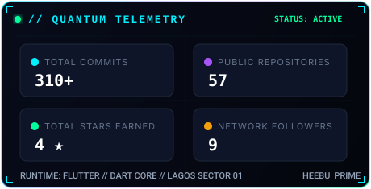
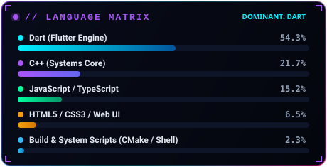

<div align="center">
  <!-- Quantum Cyberdeck Panoramic Hero Banner -->
  <a href="https://github.com/Heebu">
    
  </a>

  <br/>

  <!-- Fluid Animated Wave Accent -->
  

  <!-- Multi-Line Dynamic Holographic Typing HUD -->
  <h1>
    <a href="https://github.com/Heebu">
      
    </a>
  </h1>

  <!-- Neural Comm Badges -->
  <p align="center">
    <a href="https://github.com/Heebu" target="_blank">
      
    </a>
    &nbsp;
    <a href="https://twitter.com/Heebu_Prime" target="_blank">
      
    </a>
    &nbsp;
    <a href="https://www.linkedin.com/in/idris-adedeji-1b3162246/" target="_blank">
      
    </a>
    &nbsp;
    <a href="mailto:106799410+Heebu@users.noreply.github.com">
      
    </a>
    &nbsp;
    <a href="https://my-cv-app-theta.vercel.app" target="_blank">
      
    </a>
  </p>

  <!-- Cyber Animated Pulse Divider -->
  

</div>

<br/>

## 🛸 `// SYSTEM_TELEMETRY.log`

```yaml
┌──[ SYSTEM OPERATOR PROTOCOL ]──────────────────────────────────────────────────┐
│  • OPERATOR         : Idris Adedeji (Alias: Heebu_Prime)                       │
│  • DOMAIN           : Mobile Ecosystems • Full-Stack Architecture • Networks   │
│  • COORDINATES      : Lagos, Nigeria [Sector 01 // Earth]                      │
│  • CORE RUNTIMES    : Flutter • Dart • React • Next.js • TypeScript • Node.js  │
│  • SPECIALTY        : Offline P2P Mesh Protocols • High-Performance Dart Engines│
│  • AVAILABILITY     : 🟢 Hyper-Threaded for High-Impact Venture Collaborations  │
│  • MOTTO            : "Architecting zero-latency digital systems with finesse"  │
└────────────────────────────────────────────────────────────────────────────────┘
```

<br/>

## ⚡ `// QUANTUM_INNOVATION_DOCK`

<div align="center">

| Project Node | Architecture | Cyberdeck Protocol & Mission | Status | Live Terminal |
| :--- | :--- | :--- | :---: | :---: |
| 🌐 **[`flart`](https://github.com/Heebu/flart)** | `Dart` • `Web Engine` | Lightweight Flutter-inspired web development framework built in pure Dart | `⚡ ACTIVE R&D` | [**Inspect Repository**](https://github.com/Heebu/flart) |
| 📡 **[`NearLinkChat`](https://github.com/Heebu/NearLinkChat)** | `Flutter` • `P2P Mesh` | Offline network application allowing local Wi-Fi voice calls & messaging with zero internet | `🟢 PRODUCTION` | [**Inspect Repository**](https://github.com/Heebu/NearLinkChat) |
| 🚀 **[`prime_brower`](https://github.com/Heebu/prime_brower)** | `Flutter` • `Mobile` | Lightweight high-speed mobile browser engineered for high-performance browsing | `🚀 DEPLOYED` | [**Inspect Repository**](https://github.com/Heebu/prime_brower) |
| 💼 **[`my_cv_app`](https://github.com/Heebu/my_cv_app)** | `JavaScript` • `Vercel` | Interactive full-stack curriculum vitae and developer portfolio experience | `🌐 ONLINE` | [**Launch Application**](https://my-cv-app-theta.vercel.app) |

</div>

<br/>

## 🛰️ `// TECH_ARSENAL & WEAPONRY`

<div align="center">

### 📱 Mobile & Systems Engineering
<p align="center">
  
</p>

### 🌐 Frontend Architectures & Web Ecosystems
<p align="center">
  
</p>

### ⚙️ Backend Systems, Databases & Cloud Infra
<p align="center">
  
</p>

### 🛠️ DevOps, Tooling & Orchestration
<p align="center">
  
</p>

</div>

<br/>

## 📊 `// REAL_TIME_QUANTUM_METRICS`

<div align="center">
  <!-- Quantum Telemetry Overview Card -->
  <a href="https://github.com/Heebu">
    
  </a>
  &nbsp;
  <!-- Quantum Core Languages Matrix -->
  <a href="https://github.com/Heebu">
    
  </a>
</div>

<br/>

## 🏆 `// SYSTEM_HONORS & TROPHIES`

<div align="center">
  
</div>

<br/>

## 👾 `// CONTRIBUTION_SNAKE_MATRIX`

<div align="center">
  
</div>

<br/>

<div align="center">
  <!-- Waving Gradient Wave Footer -->
  

  <sub>⚡ Powered by Quantum Circuitry & Continuous Integration // Built with Precision for <b>Heebu</b> ⚡</sub>
</div>
